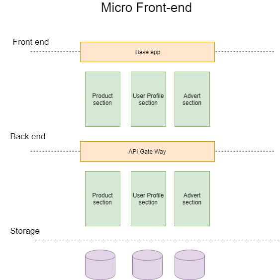

# Micro front-end architecture

In a nutshell, _Micro front-end architecture_ is micro services design principles applied to _front-end_ layer of application.

## Introduction
Design principles of Micro-frontend is very similar to Micro services design principles. Micro services are all about smaller components in the form of APIs.

### High Cohesion

Each api or service or Micro service have one responsibility and one focus.

### Autonomous

Each micro service can be independently changed without affecting other services.

### Business domain centric

Each service represent specific business domain or business function within the organization.

### Resiliency

When a service fail to function, it should be replaced without visible to the end user.

### Observable

By using centralized logging /monitoring each micro service can be observed.

### Automation

Each micro service should be able to tested independently.

## Issues with monolith front ends

### Scaling issues

* Front end application cannot be scaled up
* Require a large front end team

### Communication issues

* Multiple teams for one feature change
* Back-end teams are not customer focused

### Code and testing complexity

* Increased risk
* Slows continuous delivery

## Benefits of Micro Front ends

* Helps to create an end to end vertical slice of a feature.
* The entire vertical slice can be owned by a single team.
* Allows to scale feature independently.
* 