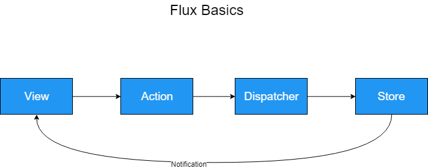

# Flux

## Basic concept

Flux is an idea. It emphasis on uni directional data flow.

When a __View__ want to read data, the process start with an __Action__, it calls a __Dispatcher__ to propagate the event. the _dispatcher_ performs an _ajax_ request and put the result in a __Store__. The _store_ then __emit__ an event to the __Views__ that _subscribed_ to it. The View then consume _data_ from _store_. When the _view_ need to __Delete__ or __Update__ _data_ from store, the _view_ call an __action__, which then call the same __dispatcher__ to _propagate_ events. The _dispatcher_ performs _ajax_ requests and update the data in the store. The _Store_ then _emit_ and __event__ to _notify_ all the views _subscribed_ to the store about the change.
